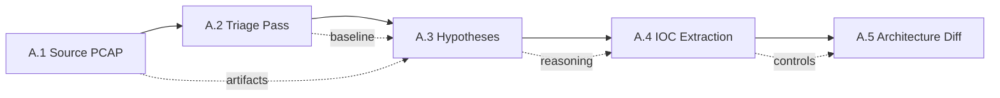
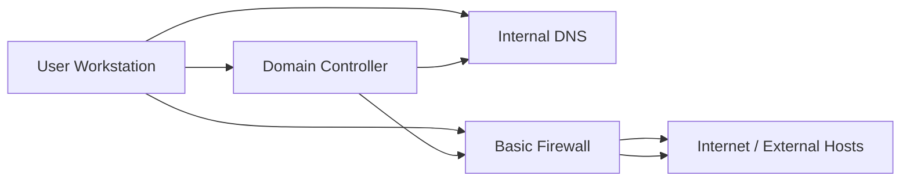
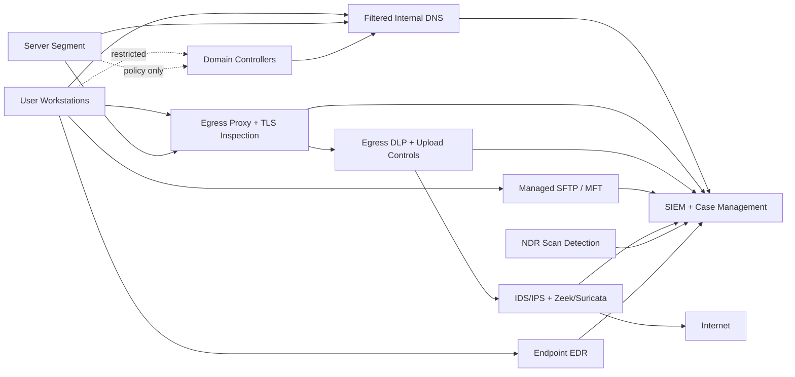

# Architecture Proposal (A.5)

## Figure 02: Workstream A Pipeline
The project follows this evidence chain:

## Current Meridian FinServe Segment
The PCAPs imply a weak enterprise segment with direct outbound access and limited inspection.

## Observed Weaknesses
| Weakness | Evidence | Risk |
|---|---|---|
| Direct outbound HTTP/HTTPS | Hancitor traffic from `10.0.0.134` to `5.252.177.17`; Trickbot traffic to `36.95.27.243`, `103.102.220.50`, and `5.199.162.3` | Malware can reach C2 without proxy enforcement. |
| Direct outbound non-standard services | RedLine POSTs from `10.10.23.101` to `188.190.10.10:55123` | Stealers can bypass simple web-only monitoring by using unusual destination ports. |
| No egress protocol validation | HTTP decoded on destination port `443` in both captures | Controls that trust port numbers miss non-TLS C2. |
| Weak DNS filtering | `larn9kany.ru`, `pariamarraire.ru`, `antivirusupdaty.com` resolved or contacted | Suspicious domains are not blocked early. |
| No DNS/TLS anomaly analytics | `exfiltration.pcap` shows high DNS and TLS volume to ad, analytics, CDN, and OCSP services | Real exfiltration can hide inside noisy web telemetry without query-frequency and SNI baselines. |
| Flat workstation-to-DC reachability | SMB/LDAP/DCERPC between infected hosts and domain controllers | Initial compromise can turn into domain compromise. |
| Cleartext legacy protocols | `ftp2.pcap` exposes `USER Administrator`, `PASS napier`, `STOR 111.png`, and `RETR manual.txt` | Credentials and files can be captured or reused by attackers. |
| Weak scan detection | `nmap_null.pcap` shows 1,030 NULL probes across 1,000 ports in about 2.6 seconds | Reconnaissance can map services before exploitation. |
| Limited payload inspection | `/15.bin`, `/15s.bin`, `/f7h7jhhjbch.exe`, `/ZsDK`, `/8mJm` downloads | Binary staging reaches endpoints. |
| Weak beacon detection | `1,689` Hancitor `/activity` requests; repeated Trickbot `/logo?hour=true` | Periodic C2 can persist unnoticed. |

## Hardened Proposed Segment

## Architecture Diff
| Component | Before | After | Why |
|---|---|---|---|
| Workstation egress | Direct outbound web access | Explicit proxy with deny-by-default outbound rules | Blocks direct C2 to IPs such as `5.252.177.17` and `5.199.162.3`. |
| Non-standard outbound ports | Allowed unless blocked manually | Default deny with approved destination/service allow-list | Blocks RedLine-style upload to `188.190.10.10:55123`. |
| Port `443` handling | Assumed HTTPS | Validate protocol and inspect TLS where lawful | Detects HTTP-over-443 behavior seen in both PCAPs. |
| DNS | Open/internal resolution | Filtered DNS with threat intel, newly registered domain controls, sinkhole, and query analytics | Blocks suspicious domains before payload retrieval and detects noisy DNS exfil patterns. |
| TLS metadata | Limited review | SNI, JA3/JA3S where available, certificate, and destination baselining | Separates normal CDN/OCSP traffic from unusual encrypted egress. |
| Workstation-to-DC access | Broad SMB/LDAP/DCERPC reachability | Micro-segmented access with workstation tiering and just-in-time admin | Reduces lateral movement from `10.0.0.134` or `10.5.26.132` to DCs. |
| FTP | Plaintext FTP allowed | Disable FTP; require managed SFTP/MFT with MFA, logging, and malware scanning | Prevents `Administrator` / `napier` style credential exposure and unmanaged file transfer. |
| Reconnaissance | No explicit scan-detection path | NDR/IDS rules for NULL, FIN, Xmas, SYN sweeps, and high unique-port counts | Detects `nmap_null.pcap` behavior quickly. |
| Payload defense | Endpoint-only prevention | Proxy file scanning, sandbox detonation, EDR quarantine | Stops `/15.bin`, `/15s.bin`, `/ZsDK`, `/8mJm`, and EXE staging. |
| Beacon and upload detection | Manual packet review | Zeek/Suricata rules plus SIEM correlation and DLP upload thresholds | Detects repeated `/activity`, `/submit.php`, `/logo?hour=true`, `/as`, `/rob87/`, `/tot108/`, and RedLine upload bursts. |
| Incident response | Ad hoc evidence gathering | Centralized telemetry with PCAP retention and case workflow | Supports the artifacts-to-reasoning-to-recommendation pipeline. |

## Recommended Detection Logic
- Alert when HTTP is decoded on destination port `443`.
- Alert on repeated requests to the same URI from one host within short intervals.
- Alert on public IP discovery followed by external binary downloads.
- Alert on direct-IP HTTP POSTs to non-standard ports.
- Alert when one internal host uploads large volumes to a new external IP in a short window.
- Alert on plaintext FTP `USER`/`PASS`, especially privileged accounts.
- Alert on TCP packets with no flags set across many destination ports.
- Alert on workstation-to-domain-controller SMB plus external C2 from either host.
- Block or sinkhole known suspicious domains and newly observed typo-squatted update/security names.

## Final Recommendation
Meridian FinServe should prioritize egress control, DNS filtering, segmented AD access, secure file-transfer replacement, scan detection, DLP, and central packet/log visibility. These controls directly address the behaviors proven across the PCAPs: payload staging, repeated C2, suspicious DNS, stealer upload, plaintext credential exposure, scanning, and lateral movement risk.
