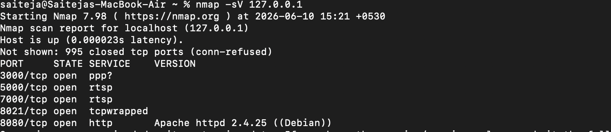
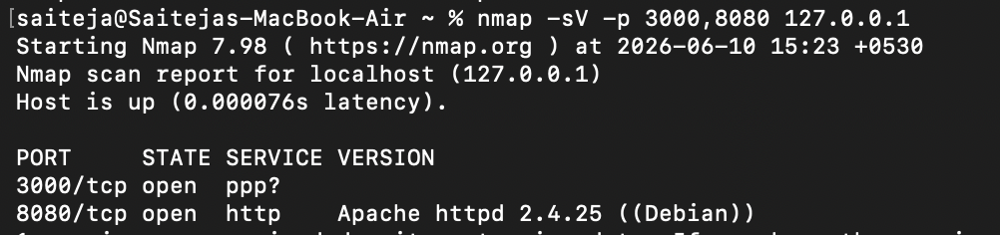

# Reconnaissance

## Objective

Identify open ports and services running on the target machine.

## Tool Used

* Nmap

## Command

```bash
nmap -sV 127.0.0.1
```
## Result

The scan identified open web services including DVWA and Juice Shop. Service information such as Apache HTTP Server was also discovered.

## Screenshots

### Full Nmap Scan



### Service Enumeration



## Impact

Attackers can use this information to identify potential targets and plan further attacks.

## Mitigation

* Close unused ports
* Restrict external access
* Monitor scanning activity
