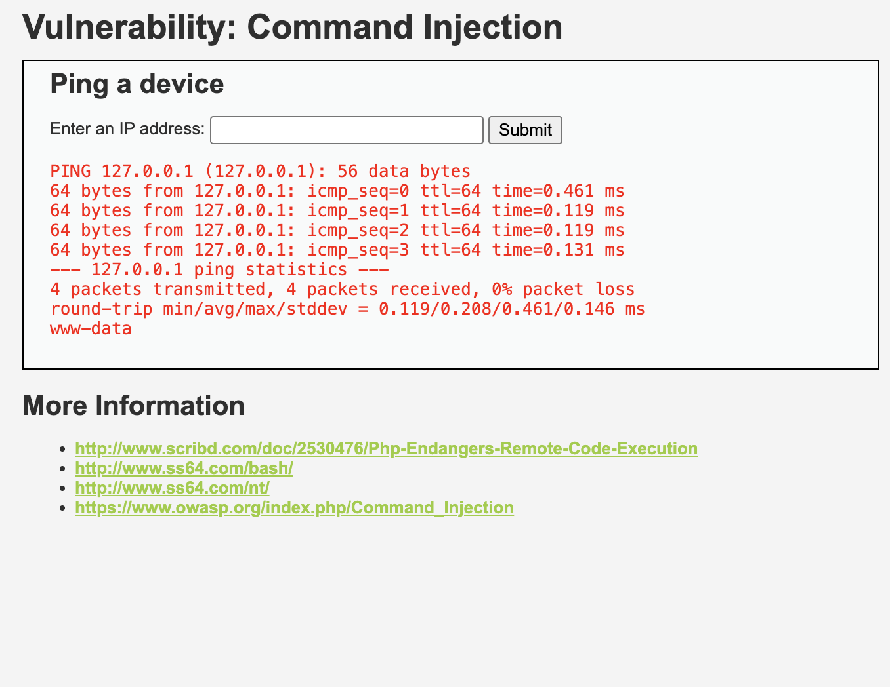

# Command Injection

## Objective

Demonstrate execution of operating system commands through vulnerable application input.

## Tool Used

- DVWA

## Steps Performed

1. Opened the Command Injection module.
2. Submitted a valid IP address.
3. Appended an additional command to the input.
4. Observed the output returned by the server.

## Result

The application executed additional operating system commands and displayed the results, indicating the presence of a command injection vulnerability.

## Screenshots

### Normal Input

### Command Injection Payload

## Impact

Command Injection vulnerabilities can allow attackers to:

- Execute arbitrary system commands
- Access sensitive files
- Gather system information
- Potentially gain control of the server

## Mitigation

- Validate and sanitize user input
- Avoid direct shell command execution
- Use allowlists for accepted input
- Implement least-privilege access controls