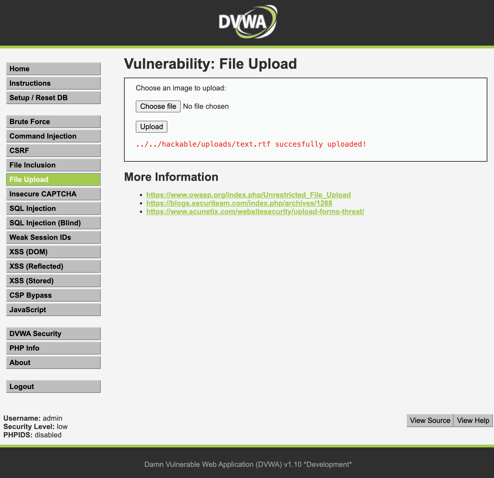

# File Upload Abuse

## Objective

Demonstrate the risks associated with unrestricted file uploads.

## Tool Used

- DVWA

## Steps Performed

1. Opened the File Upload module.
2. Selected a local file.
3. Uploaded the file to the application.
4. Verified that the file was accepted by the server.

## Result

The application successfully accepted and stored the uploaded file, demonstrating insufficient file upload restrictions.

## Screenshot

The uploaded file was successfully stored by the application.

## Impact

Unrestricted file uploads can allow attackers to:

- Upload malicious files
- Deliver malware
- Upload web shells
- Potentially gain unauthorized access to the server

## Mitigation

- Restrict allowed file types
- Validate file extensions and MIME types
- Scan uploaded files
- Store uploads outside the web root
- Enforce strict access controls