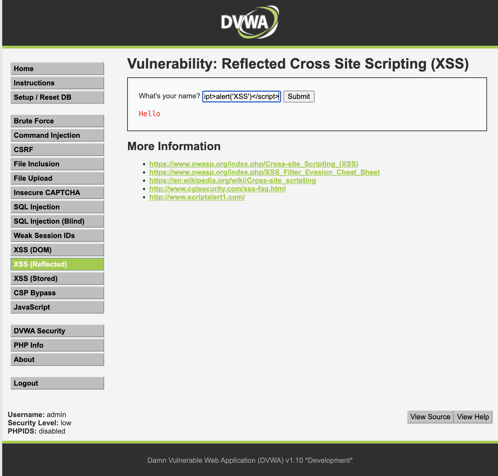
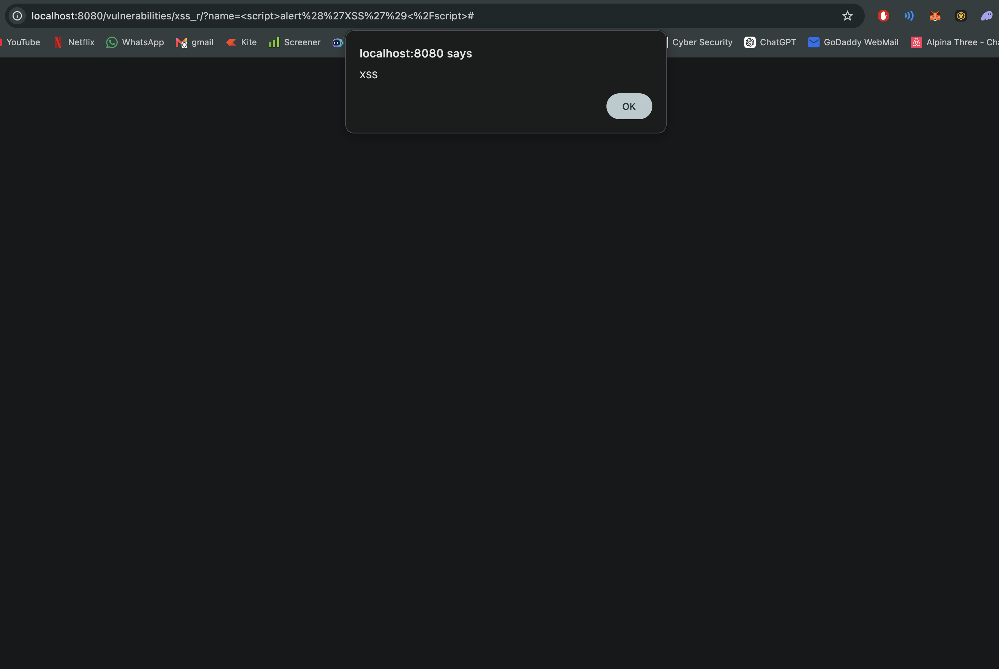

# Cross-Site Scripting (XSS)

## Objective

Demonstrate execution of client-side scripts through unsanitized user input.

## Tool Used

- DVWA

## Steps Performed

1. Opened the XSS module.
2. Entered a JavaScript payload into the input field.
3. Submitted the payload.
4. Observed script execution within the browser.

## Result

The application executed user-supplied JavaScript code, confirming the presence of a Cross-Site Scripting (XSS) vulnerability.

## Screenshots

### Payload Entered

A JavaScript payload was entered into the vulnerable input field.

### Payload Executed

The browser executed the injected script, demonstrating successful XSS.

## Impact

Cross-Site Scripting vulnerabilities can allow attackers to:

- Steal session cookies
- Hijack user sessions
- Redirect users to malicious websites
- Modify page content
- Execute malicious scripts in a victim's browser

## Mitigation

- Sanitize user input
- Encode output before rendering
- Implement Content Security Policy (CSP)
- Validate and filter user-supplied data