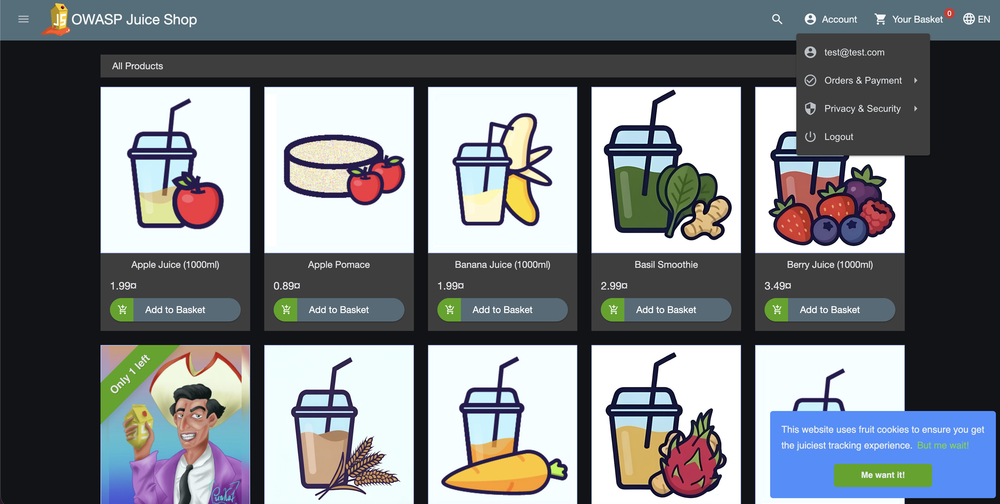
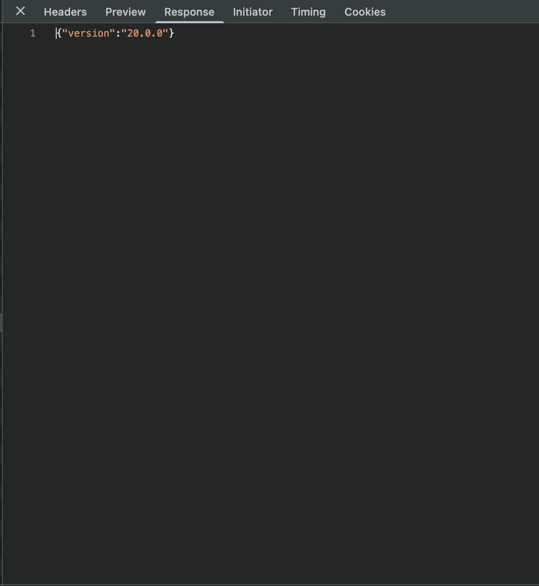
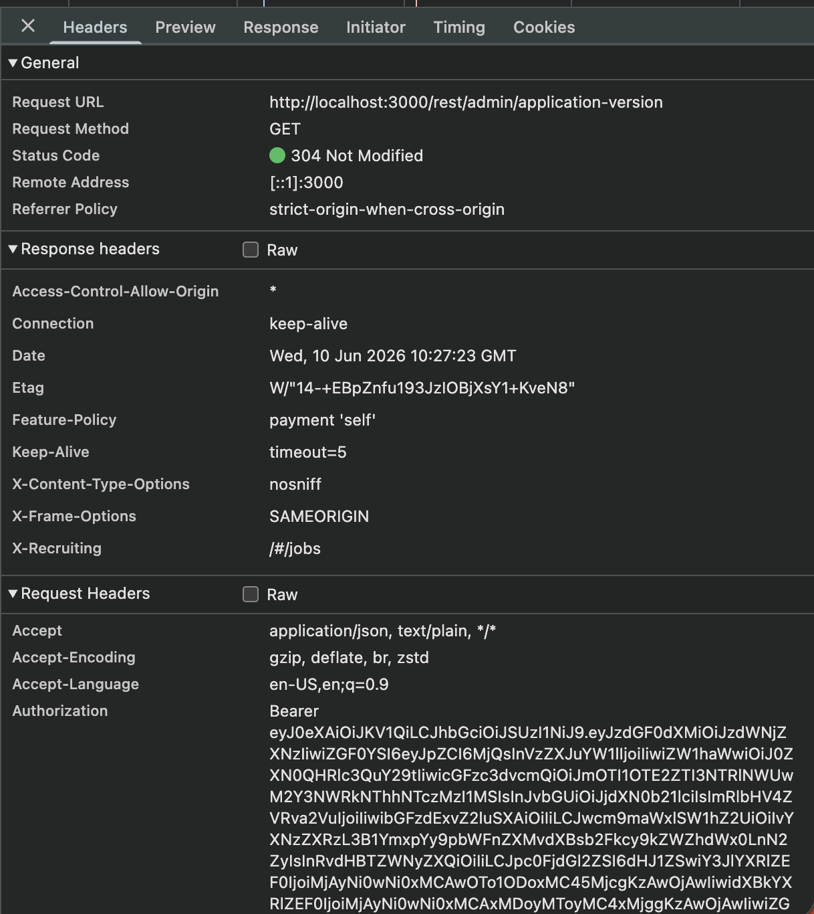
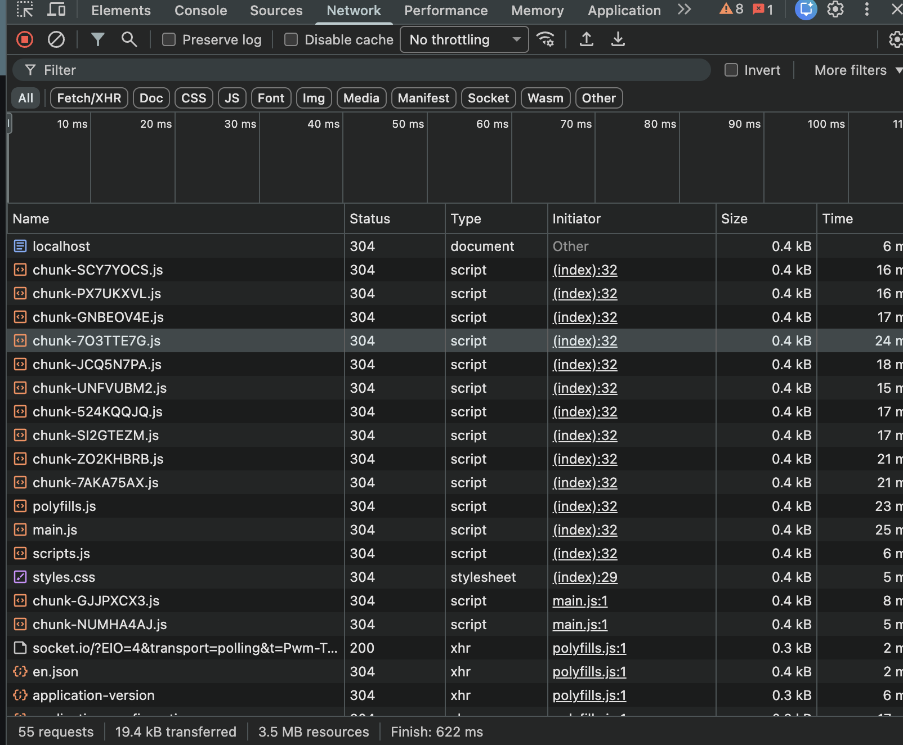

# Access Control and API Assessment

## Objective

Analyze exposed API endpoints and authentication mechanisms within OWASP Juice Shop.

## Tools Used

- OWASP Juice Shop
- Browser Developer Tools (Network Tab)

## Steps Performed

1. Logged into OWASP Juice Shop.
2. Opened Browser Developer Tools.
3. Monitored network traffic and API requests.
4. Examined API responses and authentication tokens.
5. Identified exposed application information and endpoint activity.

## Result

Several API endpoints were identified through network monitoring. Authentication tokens and application responses were observed, providing insight into how the application handles authentication and access control.

## Screenshots

### Juice Shop Login

User authentication within the application.

### Version Information

Application version information exposed through API responses.

### API Endpoint Discovery

Identification of API endpoints through browser network analysis.

### Network Traffic Analysis

Inspection of API requests and responses using Developer Tools.

## Impact

Weak access control mechanisms can lead to:

- Unauthorized access to resources
- Information disclosure
- Privilege escalation
- Exposure of sensitive application data

## Mitigation

- Enforce server-side authorization checks
- Implement role-based access control
- Restrict access to sensitive endpoints
- Validate authentication tokens
- Monitor API activity for suspicious behavior